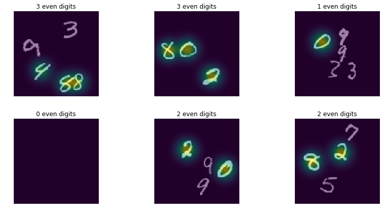

# Counting MNIST

A simple synthetic dataset and baseline model for visual counting. The task is to count the number of even digits in a given 100x100 image, each with up to 5 randomly chosen MNIST digits. We use rejection sampling to ensure digits are separated by at least 28 pixels. Reproduced with details from [Learning to count with deep object features](https://arxiv.org/abs/1505.08082).

*NOTE:* This is not a baseline to beat, but rather a simple and fast place to start for validating ideas in counting models.



## Instructions

1. Generate TFRecords:

```
python -m counting_mnist.create_dataset
```
